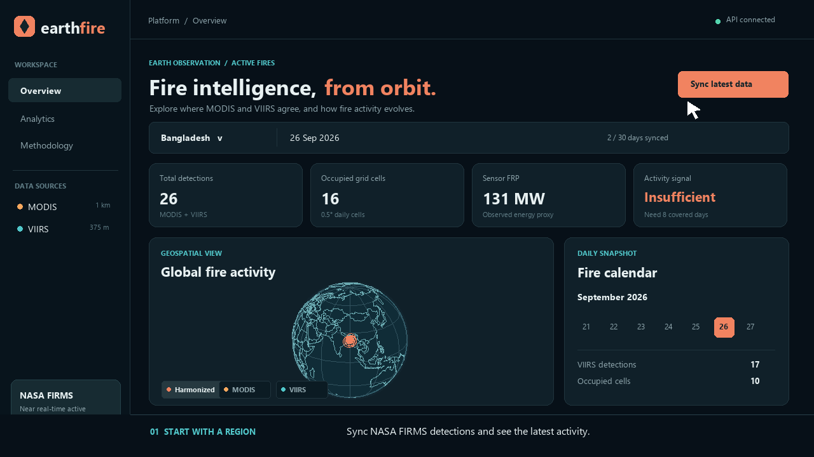

# EarthFire

EarthFire is a local NASA FIRMS explorer for comparing MODIS and VIIRS active-fire detections. It has a FastAPI/SQLite ingestion and analysis service, a React/Three.js dashboard, daily 0.5° spatial grid, statistical activity signal, and an optional LSTM next-day occupied-cell forecast.

The linked 2026 Space Apps challenge statement was unavailable when this project was created, so the implementation follows the architecture supplied in the request. Check the official challenge statement and participation rules before using this as a hackathon submission.

## Project layout

```text
backend/app/core.py     FIRMS ingestion, SQLite storage, daily grid and statistics
backend/app/main.py     FastAPI endpoints
backend/backfill.py     Historical FIRMS importer
backend/train_lstm.py  Optional TensorFlow/Keras forecast training
frontend/src/App.tsx    Dashboard controls, metrics, calendar and charts
frontend/src/Globe.tsx  Interactive 3D globe
frontend/src/style.css  Responsive dashboard styles
docs/earthfire-walkthrough.mp4  36-second captioned walkthrough
```

The local `.env`, installed dependencies and build output are excluded from Git. A snapshot of NASA FIRMS observations is committed at [`data/earthfire.sqlite3`](data/earthfire.sqlite3). The public repository includes `.env.example` instead of a live key.

## Preview and walkthrough

Run the API and dashboard as described below, then open [the local preview](http://127.0.0.1:5173/). The [36-second walkthrough video](docs/earthfire-walkthrough.mp4) illustrates the region and date controls, sensor layers, trends, and harmonization method using a synced Bangladesh snapshot.

[](docs/earthfire-walkthrough.mp4)

## Start

Requires Node.js 20+ and Python 3.11+.

1. Copy `.env.example` to `.env` and set `FIRMS_MAP_KEY` to your NASA FIRMS map key if you want to sync fresh data. The committed SQLite snapshot already provides observations to explore.
2. Install dependencies:

   ```powershell
   python -m venv .venv
   .\.venv\Scripts\python -m pip install -r backend\requirements.txt
   ```

3. Start the API in one terminal:

   ```powershell
   .\.venv\Scripts\python -m uvicorn backend.app.main:app --host 127.0.0.1 --port 8000 --reload
   ```

4. Install and start the dashboard from `frontend/` in a second terminal, then open http://127.0.0.1:5173:

   ```powershell
   Set-Location frontend
   npm install
   npm run dev
   ```

5. Click **Sync latest data**. The selected region bounds are sent to the API, which downloads the latest 3 days from MODIS NRT and VIIRS S-NPP/NOAA-20/NOAA-21 NRT. A successful sync is saved in `data/earthfire.sqlite3`.

API docs: http://127.0.0.1:8000/docs. The POST `/api/ingest` endpoint accepts a bounding box, 1–5 day range, source list, and optional `start_date` for historical requests.

## Historical data and LSTM

FIRMS standard processing (SP) and near-real-time (NRT) have different date ranges. Check [FIRMS data availability](https://firms.modaps.eosdis.nasa.gov/api/data_availability/) before choosing a source. Download a modest region for a continuous interval:

```powershell
.\.venv\Scripts\python -m backend.backfill --bbox 88 20 93 27 --start 2026-07-01 --end 2026-08-31 --sources MODIS_NRT VIIRS_NOAA20_NRT
```

This script calls the FIRMS area API in 5-day chunks. Larger regions and longer periods consume more FIRMS transactions and storage. For an exploratory next-day forecast, use a Python 3.11–3.13 virtual environment, install TensorFlow, and train after at least 60 consecutive covered days, including at least 20 days with detections. The latest TensorFlow package supports CPU training on native Windows; GPU training requires another supported platform or WSL2.

```powershell
.\.venv\Scripts\python -m pip install -r backend\requirements-ml.txt
.\.venv\Scripts\python -m backend.train_lstm --bbox 88 20 93 27
```

The API and dashboard show the saved forecast when it was trained through the latest covered day and that day is recent. The activity level remains a separate statistical comparison; the LSTM predicts next-day occupied cells and reports holdout error.

## Harmonization and limits

- All acquisitions are assigned to UTC days and 0.5° latitude/longitude cells. The map plots cell centers, not exact fire perimeters.
- Raw MODIS and VIIRS counts and summed FRP remain separate. The harmonized count is **one occupied cell per UTC day** when either sensor has detections. This avoids directly equating a 1 km MODIS pixel with a 375 m VIIRS pixel.
- Cell density is reported as occupied cells per 1,000 km². A latitude-dependent spherical area calculation adjusts the size of each grid cell.
- Harmonized FRP is the larger of sensor-specific daily FRP sums in each cell. It is an exploratory proxy, **not** a calibrated or physically additive cross-sensor FRP.
- The statistical signal compares the latest complete UTC day with up to 14 previous days. It is an activity anomaly, **not** wildfire risk or probability. Sparse coverage, clouds, satellite overpass timing, and sensor outages can change the signal.
- The LSTM is optional and reports holdout mean absolute error. Its output is experimental and should not be used for emergency decisions.

Data source: [NASA FIRMS area API](https://firms.modaps.eosdis.nasa.gov/api/area/) and [FIRMS data documentation](https://firms.modaps.eosdis.nasa.gov/content/academy/data_api/firms_api_use.html).
